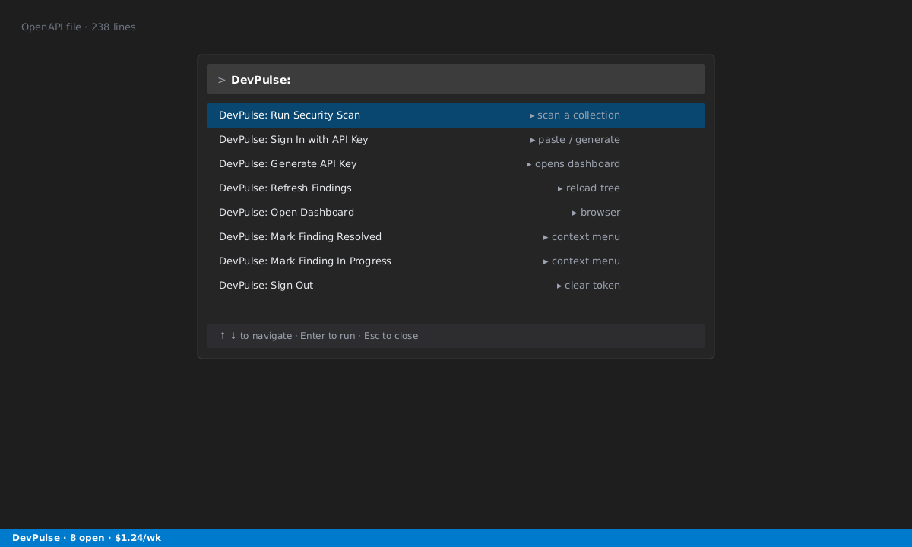
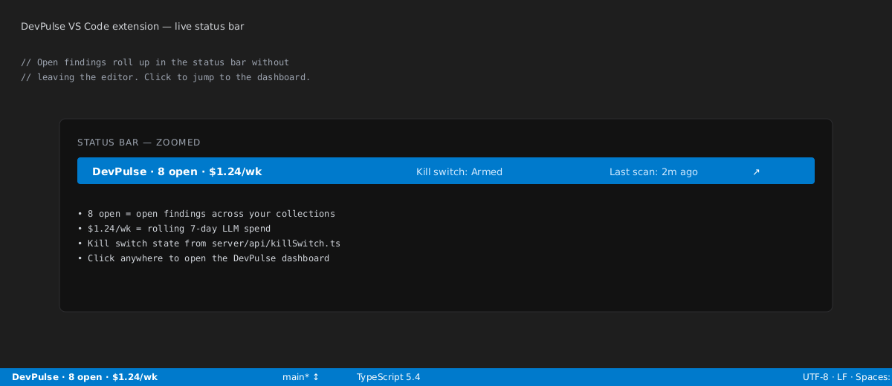

# Rakshex — Stop AI agents from burning your API budget

> The first VS Code extension that reveals hidden LLM costs, helps stop
> runaway agent loops, and scans your API collections for vulnerabilities.

---

## The Problem

If you're building with AI, you're probably paying **3× more** for LLM APIs than you realize.

- **Hidden reasoning tokens** aren't shown in provider dashboards
- **Rogue agents** can loop infinitely, burning $200+ overnight
- **API keys leak** into shared collections without anyone noticing

## What Rakshex Does

### 1. Hidden Cost Detection

Reveals reasoning tokens that OpenAI, Anthropic, and Gemini hide from you.

- Per-endpoint cost breakdown
- Weekly spend tracking
- Alerts when costs spike unexpectedly

### 2. AgentGuard Controls

Configure agent guardrails in the Rakshex dashboard (kill-switch and policy live state is managed server-side — the extension surfaces findings and cost signals).

- Detect recursive API call patterns
- Flag cost anomalies
- Configurable thresholds per project

### 3. Instant Security Scan

Import any Postman, OpenAPI, or Bruno collection. Get a full security report in seconds.

- Secret detection
- Auth weakness detection
- Injection vulnerability scanning
- OWASP API Top 10 coverage (via compliance reports in the web dashboard)

## Setup (30 Seconds)

1. **Install** — Search "Rakshex" in the VS Code Extensions panel
2. **Connect** — Run `Rakshex: Sign in with API Key` (get a free key at [rakshex.in](https://rakshex.in))
3. **Import** — Drag any API collection into the Rakshex sidebar
4. **Scan** — Click "Run Scan" and see your first findings

Most developers find at least **2 issues** they didn't know about.

## Commands

| Command                        | What It Does                                     |
| ------------------------------ | ------------------------------------------------ |
| `Rakshex: Run scan`            | Scan any imported collection for vulnerabilities |
| `Rakshex: Import collection`   | Import Postman, OpenAPI, or Bruno files          |
| `Rakshex: Open security panel` | View findings dashboard inside VS Code           |
| `Rakshex: Weekly summary`      | See money saved and threats blocked this week    |

## Privacy First

- **Your code never leaves your machine** — we only scan collections you explicitly import
- **API keys are encrypted** — stored in VS Code's SecretStorage (OS keychain)
- **No prompt logging** — we never see your LLM prompts or responses
- **Telemetry is optional** — opt out anytime in settings

Read our full [Privacy Policy](https://rakshex.in/privacy).

## Pricing

| Plan           | Cost   | Best For                                 |
| -------------- | ------ | ---------------------------------------- |
| **Free**       | $0     | Individual developers, 3 collections     |
| **Pro**        | $29/mo | Professional developers, unlimited scans |
| **Enterprise** | Custom | Teams, SSO, on-premise                   |

**Free during beta.** No credit card required.

## Support

- [Discord community](https://discord.gg/rakshex)
- [GitHub Issues](https://github.com/rakshex/rakshex/issues)
- [support@rakshex.in](mailto:support@rakshex.in)

## License

MIT
