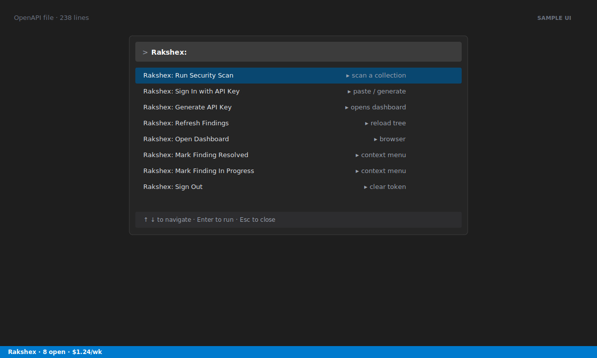
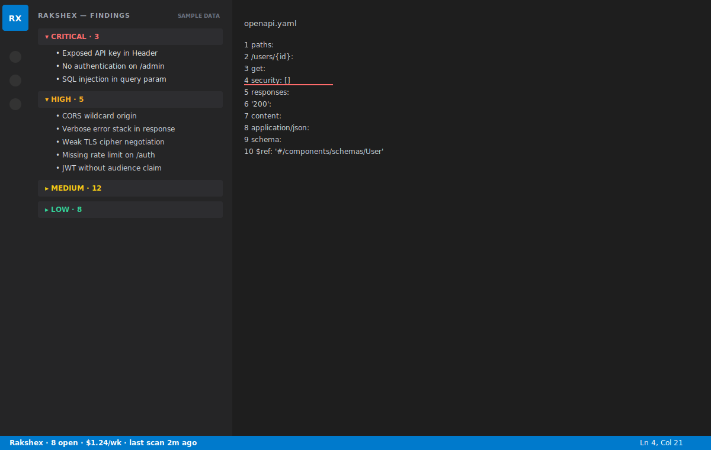
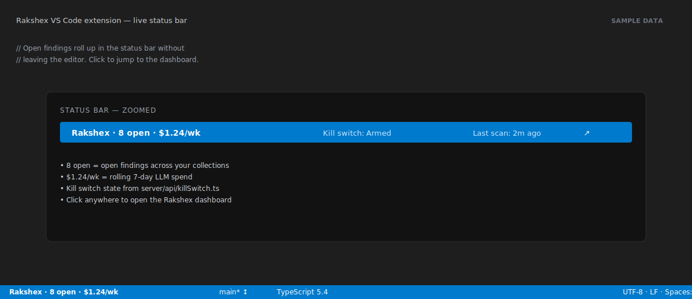

# Rakshex — Agent Firewall controls inside VS Code

> The VS Code companion for Rakshex, the AI Agent Action Control Plane.
> Scan your AI agent configurations and API collections for leaked secrets and
> prompt-injection surfaces, manage control-plane policy state, and see firewall
> decisions — right from the editor.

---

## The Problem

Autonomous AI agents are taking consequential actions — refunds, transfers, data
writes, production deploys — with no authorization layer in between. One prompt
injection or one misconfigured capability token can turn an agent's tools into an
attacker's tools.

## What Rakshex Does

The Rakshex platform authorizes agent actions **before** they execute:

- **Server-side policy evaluation** — `ALLOW | DENY | APPROVAL_REQUIRED | LIMIT | PAUSE | FREEZE` for every semantic action, evaluated against delegated authority and YAML policies
- **Fail-closed credential mediation** — agents never hold secrets; credentials are released single-use, only on a true `ALLOW`
- **Hash-chained Action Ledger** — every decision recorded tamper-evident, with Ed25519-signed receipts you can export and verify
- **Prompt-injection detection** — static and runtime layers flag jailbreak and injection surfaces in agent configs and API inputs
- **Secret scanning** — leaked API keys, tokens, and credentials in collections, environment files, and code

This extension brings those controls into the editor:

### 1. Instant Security Scan

Import any Postman, OpenAPI, or Bruno collection. Get a full security report in seconds.

- Secret detection
- Auth weakness detection
- Injection vulnerability scanning
- OWASP API Top 10 coverage (via compliance reports in the web dashboard)

### 2. AgentGuard Controls

Configure agent guardrails in the Rakshex dashboard (kill-switch and policy live state is managed server-side — the extension surfaces findings and policy signals).

- Detect recursive API call patterns
- Flag runaway usage before budget thresholds trip
- Configurable policy per project

### 3. Firewall Decisions at a Glance

See recent `evaluate` decisions for your agents — which actions were allowed, denied, or held for approval — and the ledger evidence behind each one.

## Setup (30 Seconds)

1. **Install** — Search "Rakshex" in the VS Code Extensions panel
2. **Connect** — Run `Rakshex: Sign in with API Key` (get a free key at [rakshex.in](https://rakshex.in))
3. **Import** — Drag any API collection into the Rakshex sidebar
4. **Scan** — Click "Run Scan" and see your first findings

## Commands

| Command                        | What It Does                                     |
| ------------------------------ | ------------------------------------------------ |
| `Rakshex: Run scan`            | Scan any imported collection for vulnerabilities |
| `Rakshex: Import collection`   | Import Postman, OpenAPI, or Bruno files          |
| `Rakshex: Open security panel` | View findings dashboard inside VS Code           |

## Privacy First

- **Your code never leaves your machine** — we only scan collections you explicitly import
- **API keys are encrypted** — stored in VS Code's SecretStorage (OS keychain)
- **No prompt logging** — privacy modes let you run metadata-only or zero-retention; we never need your raw prompts
- **Telemetry is optional** — opt out anytime in settings

Read our full [Privacy Policy](https://rakshex.in/privacy).

## Pricing

| Plan           | Cost   | Best For                                 |
| -------------- | ------ | ---------------------------------------- |
| **Free**       | $0     | Individual developers, 3 collections     |
| **Pro**        | $29/mo | Professional developers, unlimited scans |
| **Enterprise** | Custom | Teams, SSO, on-premise                   |

**Free during private beta.** No credit card required.

## Support

- [Discord community](https://discord.gg/rakshex)
- [GitHub Issues](https://github.com/rakshex/rakshex/issues)
- [support@rakshex.in](mailto:support@rakshex.in)

## License

MIT
