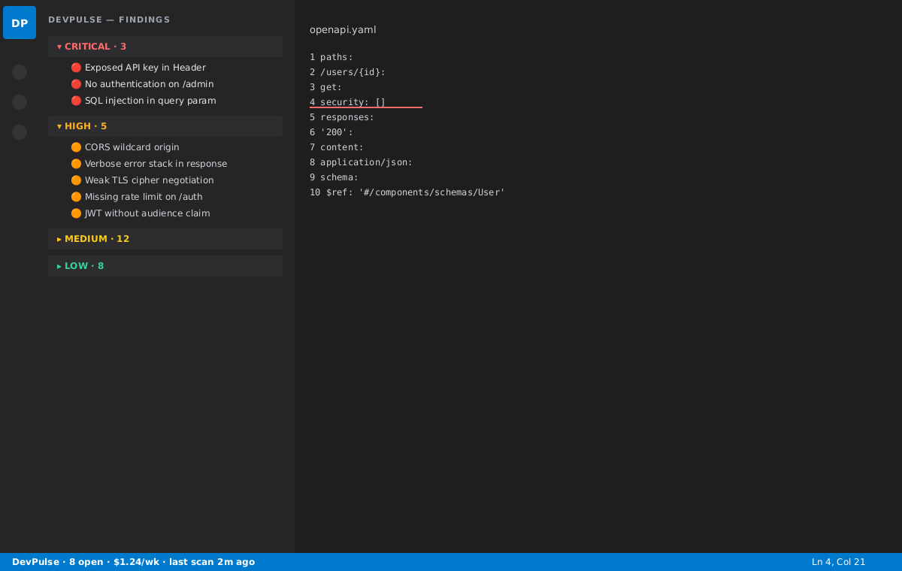

# DevPulse for VS Code

> Monitor DevPulse security findings, LLM cost, and scan status without
> leaving your editor.

DevPulse pairs with your DevPulse dashboard to surface open security
findings, kill-switch status, and weekly LLM spend right in the activity
bar and status bar.



## Features

- **Findings tree view** grouped by severity (Critical / High / Medium /
  Low) with inline actions to mark findings in-progress or resolved.
- **Status bar item** showing open findings count and weekly LLM spend,
  click-through to the dashboard.
- **Run scan** command that queues a new scan for any of your
  collections from the Command Palette.
- **Activity heartbeat** that reports editor activity to your DevPulse
  backend so dashboard metrics stay live — never sends file contents.
- **API-key authentication** — generate a key from the DevPulse
  dashboard, paste it into VS Code, done. Keys live in VS Code's
  `SecretStorage`, never in `settings.json`.

## Quick start

1. **Install** — from the VS Code Marketplace search for "DevPulse", or
   drop a `.vsix` from
   `vsce package` (see `PUBLISHING.md`) onto the Extensions panel.
2. **Sign in** — open the Command Palette → **DevPulse: Sign in with
   API Key**. Paste a key from `Settings → API Keys` in the DevPulse
   dashboard.
3. **(Self-hosted only)** — set `devpulse.apiUrl` to your backend URL.

Open findings will populate the **DevPulse** view in the activity bar
within a few seconds, and the status bar will show
`DevPulse · N open · $X.XX/wk`.


## Commands


| Command                              | Description                                              |
| ------------------------------------ | -------------------------------------------------------- |
| `DevPulse: Sign in with API Key`     | Save your API key into VS Code's secret storage.         |
| `DevPulse: Sign out`                 | Remove the saved API key.                                |
| `DevPulse: Refresh`                  | Re-fetch findings and dashboard summary.                 |
| `DevPulse: Run scan`                 | Queue a scan for a selected collection.                  |
| `DevPulse: Open dashboard`           | Open the DevPulse web dashboard in your default browser. |
| `DevPulse: Mark finding resolved`    | Resolve the currently-selected finding.                  |
| `DevPulse: Mark finding in-progress` | Mark the currently-selected finding as in-progress.      |

## Settings

| Setting                         | Default                 | Description                                                      |
| ------------------------------- | ----------------------- | ---------------------------------------------------------------- |
| `devpulse.apiUrl`               | `http://localhost:3000` | Base URL of your DevPulse backend.                               |
| `devpulse.heartbeatIntervalSec` | `120`                   | Seconds between heartbeats. Set `0` to disable.                  |
| `devpulse.trackFileChanges`     | `true`                  | Send `file_change` activity events (filename only, no contents). |

## Privacy

This extension sends a minimal activity stream to the configured
DevPulse backend so dashboards stay accurate:

- **heartbeat** — empty payload, periodic.
- **file_change** — relative file path only (no contents, no diffs).
- **session_start** / **session_end** — timestamps.

No source code, buffer contents, or git history ever leaves your
machine. Disable activity entirely by setting
`devpulse.heartbeatIntervalSec` to `0`.

## Building from source

```bash
cd devpulse-vscode
npm install
npm run compile
```

Load the `devpulse-vscode/` folder via **Extensions: Install from
VSIX...** or hit **F5** in VS Code to launch an Extension Development
Host with the extension already loaded.

## Publishing

See [`PUBLISHING.md`](./PUBLISHING.md) for the full vsce +
Open VSX publishing guide.

## License

MIT
